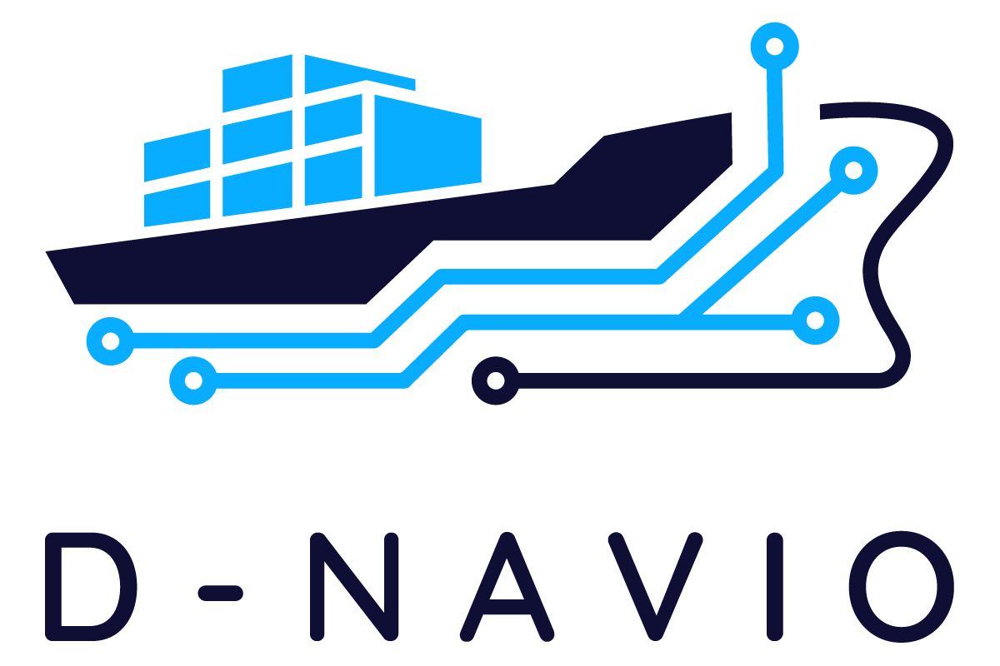

<p align="center">
  <picture>
    <source media="(prefers-color-scheme: dark)" srcset="assets/PrimaryLogo-white-bg.png">
    <source media="(prefers-color-scheme: light)" srcset="assets/PrimaryLogo.png">
    
  </picture>
</p>

# D-NAVIO

Initial infrastructure setup for the D-NAVIO Digital Twin platform.

This repository contains the initial deployment configuration and documentation
for the D-NAVIO core platform services.

Docker Compose is maintained as the validated development/bootstrap baseline,
while this branch introduces the Kubernetes bootstrap deployment for the
development cluster.

## Platform Components

The initial platform stack includes:

- **Kafka** (KRaft mode) — asynchronous event backbone and message broker
- **Keycloak** — authentication and identity management
- **MinIO** — object storage for datasets and binary artefacts

## Architecture Principles

D-NAVIO uses Kafka as the event backbone for live events and async
communication between platform components (DML, DYNAMO, DSS, XAI, FRS,
UI backend, Observability). Bulk datasets and binary artefacts are stored
in MinIO. Authentication and authorisation are handled through Keycloak.

Kafka carries live events only — it is not used as a database.
The initial logical topic set covers:

- `dnavio.telemetry.raw` / `dnavio.telemetry.processed`
- `dnavio.alerts`
- `dnavio.failures`
- `dnavio.risk`

## Kafka Message Broker Validation

Kafka is used as the asynchronous event backbone of the D-NAVIO platform.

For topic creation and producer/consumer validation, see
[`docs/kafka-guide.md`](docs/kafka-guide.md).

The initial logical topic set includes:

- `dnavio.telemetry.raw`
- `dnavio.telemetry.processed`
- `dnavio.alerts`
- `dnavio.failures`
- `dnavio.risk`

## Prerequisites

**Kubernetes setup:**

- `kubectl`
- A running Kubernetes cluster (validated with kubeadm + Flannel on a single-node VM)
- Git

**Docker Compose setup (bootstrap baseline):**

- Docker
- Docker Compose
- Git

Optional: VS Code, PyCharm

## Installing

```bash
git clone https://github.com/epu-ntua/d-navio.git
cd d-navio
```

## Running

### Kubernetes development cluster

Apply the storage provisioner first (required on bare kubeadm clusters with no default StorageClass):

```bash
kubectl apply -f infra/local-path-provisioner.yaml
```

> **Note:** `local-path-provisioner` is used only for the single-node development cluster.
> Pilot-grade or production-like deployments should use a proper CSI-backed storage solution,
> such as Longhorn, Rook/Ceph, NFS CSI, or cloud-managed persistent volumes depending on the
> target infrastructure.

Deploy all platform services:

```bash
kubectl apply -f k8s/namespace.yaml
kubectl apply -f k8s/
```

Check status:

```bash
kubectl get pods,pvc,svc -n dnavio-dev
```

See [`docs/install-k8s.md`](docs/install-k8s.md) for the full Kubernetes installation guide.

### Docker Compose bootstrap baseline

```bash
docker compose -f docker/docker-compose.dev.yml up -d
```

Stop:

```bash
docker compose -f docker/docker-compose.dev.yml down
```

See [`docs/install-docker.md`](docs/install-docker.md) for the full Docker installation guide.

## Service Endpoints

### Kubernetes (via port-forward)

Services are ClusterIP — access them with `kubectl port-forward`:

```bash
kubectl port-forward svc/keycloak 18080:8080 -n dnavio-dev
kubectl port-forward svc/minio 19000:9000 19001:9001 -n dnavio-dev
```

| Service       | Forwarded endpoint           |
|---------------|------------------------------|
| Keycloak      | `http://localhost:18080`     |
| MinIO Console | `http://localhost:19001`     |
| MinIO API     | `http://localhost:19000`     |

### Docker Compose

| Service       | Endpoint                |
|---------------|-------------------------|
| Kafka broker  | `localhost:9092`        |
| Keycloak      | `http://localhost:8080` |
| MinIO API     | `http://localhost:9000` |
| MinIO Console | `http://localhost:9001` |

Default development credentials: `admin / adminadmin`

## Repository Structure

```text
d-navio/
├── assets/
├── docker/
│   └── docker-compose.dev.yml
├── docs/
│   ├── architecture.md
│   ├── install-docker.md
│   ├── install-k8s.md
│   ├── kafka-guide.md
│   └── partners-onboarding.md
├── infra/
│   └── local-path-provisioner.yaml
└── k8s/
    ├── namespace.yaml
    ├── kafka-deployment.yaml
    ├── kafka-service.yaml
    ├── kafka-data-persistentvolumeclaim.yaml
    ├── keycloak-deployment.yaml
    ├── keycloak-service.yaml
    ├── minio-deployment.yaml
    ├── minio-service.yaml
    └── minio-data-persistentvolumeclaim.yaml
└── scripts/
    └── kafka/
        ├── create-topics.sh
        ├── list-topics.sh
        ├── produce-test-message.sh
        └── consume-topic.sh
```

## Deployment Targets

| Environment         | Stack                 | Status    |
|---------------------|-----------------------|-----------|
| Development VM      | Docker Compose        | Validated |
| Development cluster | Kubernetes (kubeadm)  | Validated |
| Integration / Test  | Kubernetes            | Planned   |
| Pilot / Demo        | Kubernetes            | Planned   |

## Contributing

Please read `CONTRIBUTING.md` for the expected workflow.

## Authors

- Michael Kontoulis
- George Doukas
- George Nanos
- Sofianos Lampropoulos

## License

License information will be added.
