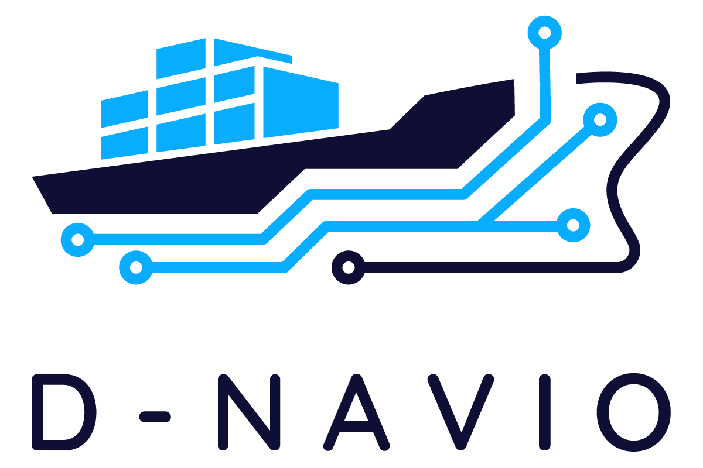

<p align="center">
  
</p>

# D-NAVIO 

REPO-TYPE

Initial infrastructure setup for the D-NAVIO Digital Twin platform.

This repository contains the initial deployment configuration and documentation
for the core platform services used in D-NAVIO.

## Getting Started

These instructions will get a development instance of the D-NAVIO platform
running on a local machine or VM for testing and development purposes.

See the documentation under `docs/` for architecture, installation,
and partner onboarding notes.

## Platform Components

The initial platform stack includes:

- Kafka (KRaft mode) for event streaming and metadata exchange
- Keycloak for authentication and identity management
- MinIO for object storage of datasets and binary artifacts

## Architecture Principles

D-NAVIO uses Kafka as an event backbone for metadata, orchestration signals,
and lifecycle events, while bulk datasets and binary artifacts are stored
in MinIO object storage.

Authentication and service authorization are handled through Keycloak.

This means:

- Large files are uploaded to MinIO
- Kafka carries metadata, pointers, and processing events
- Services consume Kafka events and fetch data from MinIO
- Access to services is managed through Keycloak

## Prerequisites

Before running the platform ensure the following are installed:

- Docker
- Docker Compose
- Git

Optional but recommended:

- VS Code
- PyCharm

## Installing

Clone this repository:

```bash
git clone https://github.com/epu-ntua/d-navio.git
cd d-navio
```

## Running

Start the initial development stack:

```bash
docker compose -f docker/docker-compose.dev.yml up -d
```

Stop the stack:

```bash
docker compose -f docker/docker-compose.dev.yml down
```

## Service Endpoints

- Kafka broker: `localhost:9092`
- Keycloak: `http://localhost:8080`
- MinIO API: `http://localhost:9000`
- MinIO Console: `http://localhost:9001`

## Repository Structure

```text
d-navio/
├── assets/
│   └── PrimaryLogo.png
├── CONTRIBUTING.md
├── README.md
├── docker/
│   └── docker-compose.dev.yml
├── docs/
│   ├── architecture.md
│   ├── install.md
│   └── partners-onboarding.md
└── scripts/
```

## Deployment

This repository currently provides an initial Docker-based deployment
for development and VM bootstrap purposes.

The first deployment target is a development VM for the D-NAVIO project.

## Contributing

Please read `CONTRIBUTING.md` for the expected workflow.

## Authors

- Michael Kontoulis
- George Doukas
- George Nanos
- Sofianos Lampropoulos

## License

License information will be added.
